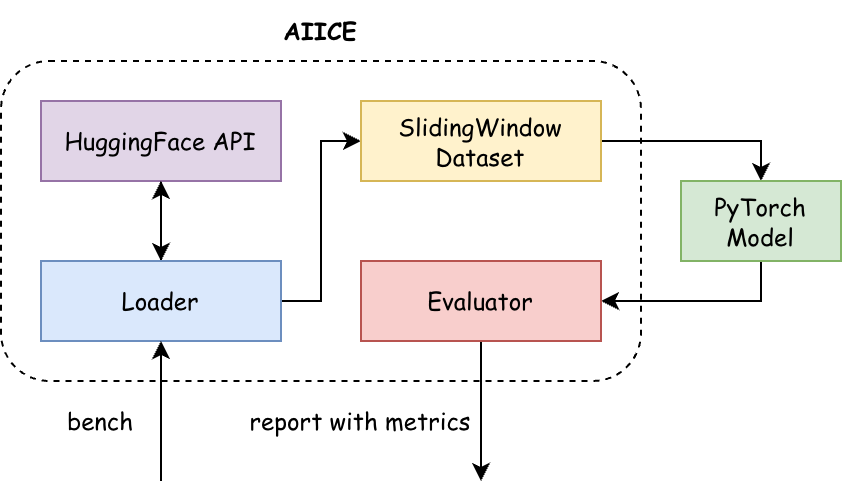

# Aiice

[](https://uv.io)
[](https://huggingface.co/)
[](https://pytorch.org/)
[](https://numpy.org/)

---

**AIICE** is an open-source Python framework designed as a standardized benchmark for spatio-temporal forecasting of Arctic sea ice concentration. It provides reproducible pipelines for loading, preprocessing, and evaluating satellite-derived OSI-SAF data, supporting both short- and long-term prediction horizons

## Installation

The simplest way to install framework with `pip`:
```shell
pip install aiice-bench
```

## Quickstart

The AIICE class provides a simple interface for loading Arctic ice data, preparing datasets, and benchmarking PyTorch models:



```python
from aiice import AIICE

# Initialize AIICE with a sliding window 
# of past 30 days and forecast of 7 days
aiice = AIICE(
    pre_history_len=30,
    forecast_len=7,
    batch_size=32,
    start="2022-01-01",
    end="2022-12-31"
)

# Define your PyTorch model
model = MyModel()

# Run benchmarking to compute metrics on the dataset
report = aiice.bench(model)
print(report)
```

Check **[package doc](https://itmo-nss-team.github.io/Aiice/aiice.html)** and see more **[usage examples](https://github.com/ITMO-NSS-team/Aiice/tree/main/scripts/examples)**. You can also explore the **[raw dataset](https://huggingface.co/datasets/ITMO-NSS/Aiice)** and work with it independently via Hugging Face

## Leaderboard

The leaderboard reports the mean performance of each model across the evaluation dataset. You can check models' setup in [examples](./scripts/experiments).

<!-- benchmark -->
<table border="1" class="dataframe">
  <thead>
    <tr style="text-align: right;">
      <th></th>
      <th></th>
      <th>baseline_mean</th>
      <th>baseline_repeat</th>
    </tr>
  </thead>
  <tbody>
    <tr>
      <th rowspan="7" valign="top">Barents Sea</th>
      <th>bin_accuracy</th>
      <td><b>0.874963</b></td>
      <td>0.848936</td>
    </tr>
    <tr>
      <th>iou</th>
      <td>0.185126</td>
      <td><b>0.331170</b></td>
    </tr>
    <tr>
      <th>mae</th>
      <td><b>0.130236</b></td>
      <td>0.151377</td>
    </tr>
    <tr>
      <th>mse</th>
      <td><b>0.053554</b></td>
      <td>0.106431</td>
    </tr>
    <tr>
      <th>psnr</th>
      <td><b>12.712070</b></td>
      <td>9.729317</td>
    </tr>
    <tr>
      <th>rmse</th>
      <td><b>0.231418</b></td>
      <td>0.326238</td>
    </tr>
    <tr>
      <th>ssim</th>
      <td>0.540464</td>
      <td><b>0.609196</b></td>
    </tr>
    <tr>
      <th rowspan="7" valign="top">Chukchi Sea</th>
      <th>bin_accuracy</th>
      <td>0.656515</td>
      <td><b>0.675528</b></td>
    </tr>
    <tr>
      <th>iou</th>
      <td>0.126601</td>
      <td><b>0.364351</b></td>
    </tr>
    <tr>
      <th>mae</th>
      <td><b>0.269926</b></td>
      <td>0.300754</td>
    </tr>
    <tr>
      <th>mse</th>
      <td><b>0.124306</b></td>
      <td>0.246038</td>
    </tr>
    <tr>
      <th>psnr</th>
      <td><b>9.055069</b></td>
      <td>6.089983</td>
    </tr>
    <tr>
      <th>rmse</th>
      <td><b>0.352571</b></td>
      <td>0.496022</td>
    </tr>
    <tr>
      <th>ssim</th>
      <td><b>0.405798</b></td>
      <td>0.385161</td>
    </tr>
    <tr>
      <th rowspan="7" valign="top">Kara Sea</th>
      <th>bin_accuracy</th>
      <td><b>0.801598</b></td>
      <td>0.797711</td>
    </tr>
    <tr>
      <th>iou</th>
      <td>0.282630</td>
      <td><b>0.412451</b></td>
    </tr>
    <tr>
      <th>mae</th>
      <td><b>0.162785</b></td>
      <td>0.185920</td>
    </tr>
    <tr>
      <th>mse</th>
      <td><b>0.070723</b></td>
      <td>0.136968</td>
    </tr>
    <tr>
      <th>psnr</th>
      <td><b>11.504373</b></td>
      <td>8.633821</td>
    </tr>
    <tr>
      <th>rmse</th>
      <td><b>0.265939</b></td>
      <td>0.370091</td>
    </tr>
    <tr>
      <th>ssim</th>
      <td><b>0.604080</b></td>
      <td>0.590542</td>
    </tr>
    <tr>
      <th rowspan="7" valign="top">Laptev Sea</th>
      <th>bin_accuracy</th>
      <td>0.839829</td>
      <td><b>0.863018</b></td>
    </tr>
    <tr>
      <th>iou</th>
      <td>0.387533</td>
      <td><b>0.534633</b></td>
    </tr>
    <tr>
      <th>mae</th>
      <td><b>0.115111</b></td>
      <td>0.122237</td>
    </tr>
    <tr>
      <th>mse</th>
      <td><b>0.051770</b></td>
      <td>0.094377</td>
    </tr>
    <tr>
      <th>psnr</th>
      <td><b>12.859248</b></td>
      <td>10.251351</td>
    </tr>
    <tr>
      <th>rmse</th>
      <td><b>0.227529</b></td>
      <td>0.307208</td>
    </tr>
    <tr>
      <th>ssim</th>
      <td><b>0.782073</b></td>
      <td>0.746823</td>
    </tr>
    <tr>
      <th rowspan="7" valign="top">Sea of Japan</th>
      <th>bin_accuracy</th>
      <td><b>0.994356</b></td>
      <td>0.989473</td>
    </tr>
    <tr>
      <th>iou</th>
      <td>0.000000</td>
      <td><b>0.035046</b></td>
    </tr>
    <tr>
      <th>mae</th>
      <td><b>0.013824</b></td>
      <td>0.016332</td>
    </tr>
    <tr>
      <th>mse</th>
      <td><b>0.004467</b></td>
      <td>0.009577</td>
    </tr>
    <tr>
      <th>psnr</th>
      <td><b>23.499943</b></td>
      <td>20.187490</td>
    </tr>
    <tr>
      <th>rmse</th>
      <td><b>0.066835</b></td>
      <td>0.097865</td>
    </tr>
    <tr>
      <th>ssim</th>
      <td>0.841847</td>
      <td><b>0.879064</b></td>
    </tr>
  </tbody>
</table>
<!-- benchmark -->
